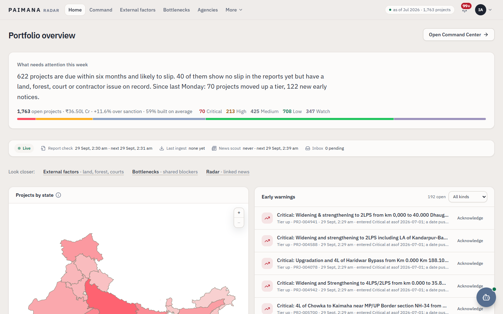
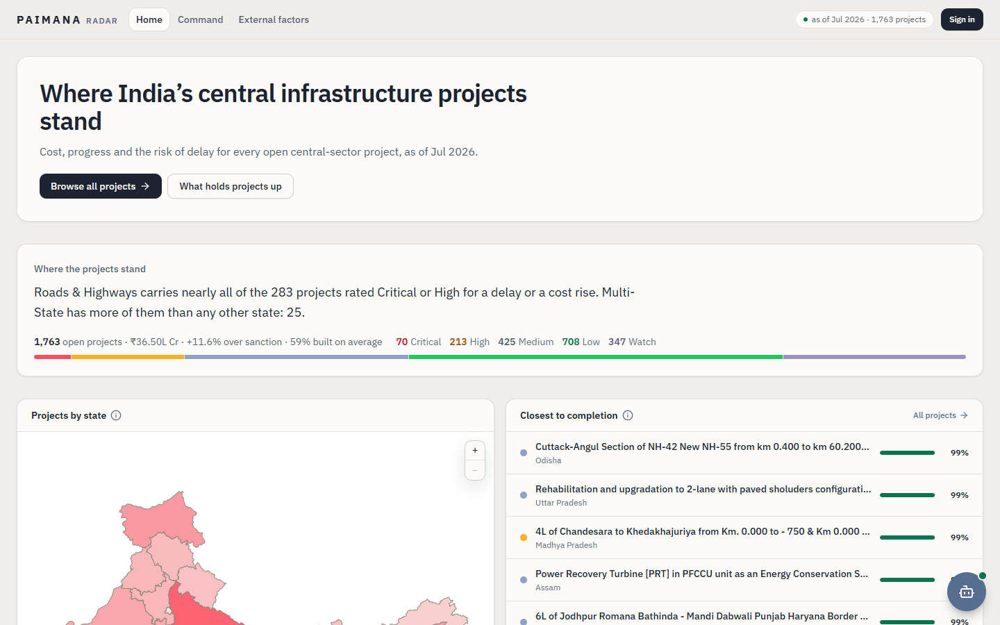
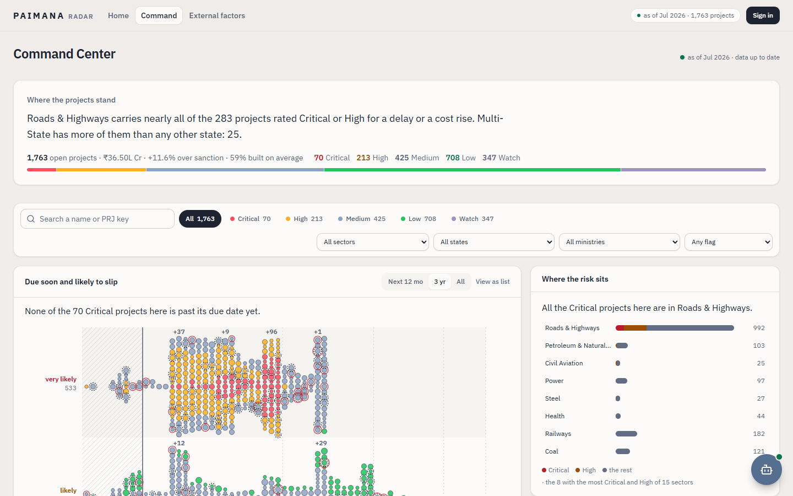
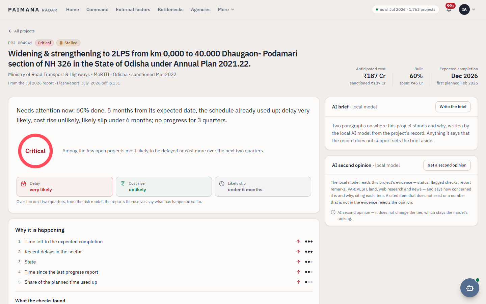
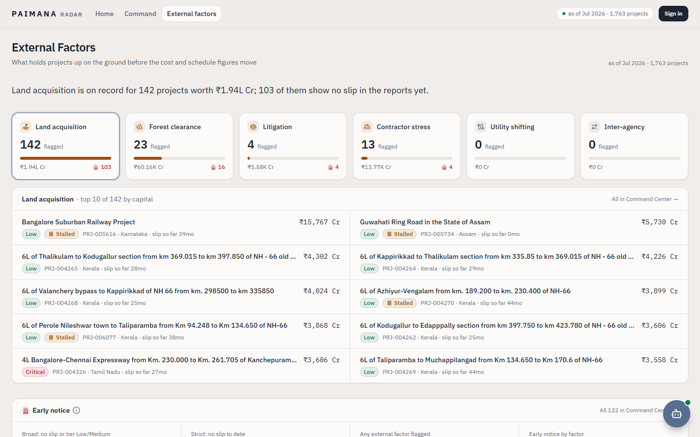
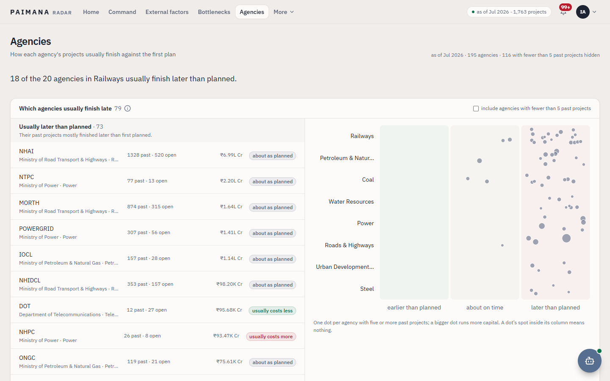
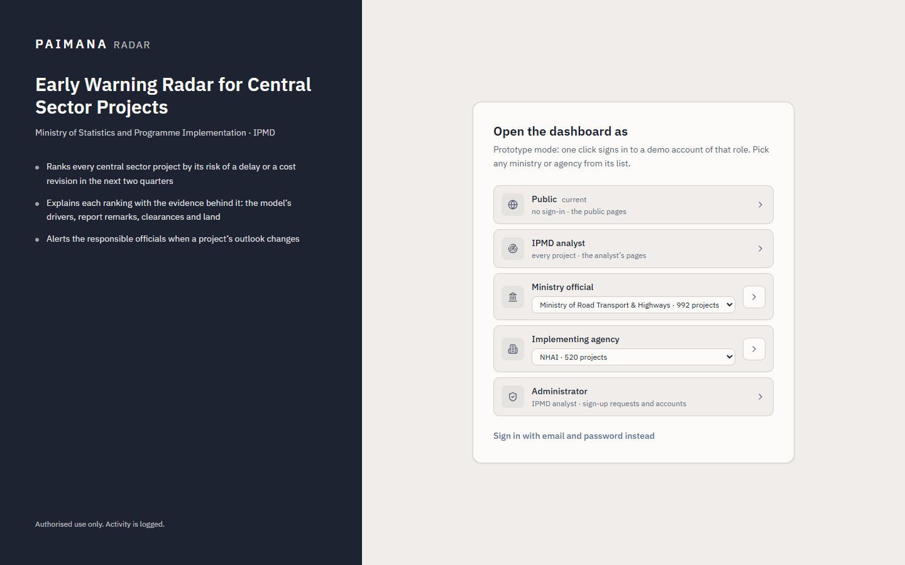
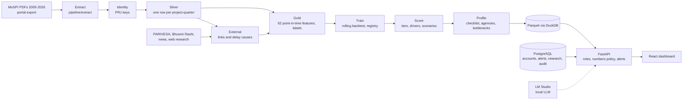

# PAIMANA Radar

**An early-warning system for India's central-sector infrastructure projects.**
Smart India Hackathon 2026 · Problem statement **26103** · Ministry of Statistics and Programme Implementation (MoSPI),
Infrastructure and Project Monitoring Division (IPMD).

MoSPI tracks every central-sector infrastructure project of Rs 150 crore and above through quarterly QPISR reports
and monthly flash reports. By the time a delay or a cost overrun shows up in one of those reports, the project has
usually been in trouble for months. PAIMANA Radar reads every monitoring report MoSPI has published since 2005,
predicts which of today's projects will report a slip in their next reports, and explains why in plain words, with
the evidence next to it.



---

## Contents

- [What it does](#what-it-does)
- [Results](#results)
- [Quick start (Docker, one command)](#quick-start-docker-one-command)
- [Screenshots](#screenshots)
- [How it works](#how-it-works)
- [Roles and access](#roles-and-access)
- [The AI features](#the-ai-features)
- [Development setup](#development-setup)
- [Production deployment](#production-deployment)
- [Tests](#tests)
- [Tech stack](#tech-stack)
- [Repository layout](#repository-layout)
- [Limitations](#limitations)
- [Documentation](#documentation)
- [Data sources](#data-sources)
- [Team](#team)

---

## What it does

- **One history per project.** 262 MoSPI PDFs (2005 to 2026) and the PAIMANA portal export are parsed into 167,280
  typed rows and linked into a single history per project under a stable `PRJ-xxxxxx` key (73,167 project-quarters).
- **Predicts slips before they are reported.** For each of the 1,763 projects in the July 2026 flash report,
  LightGBM models estimate how likely the next reports are to push the anticipated completion by 3 months or more,
  or raise the anticipated cost by 5% or more, within two quarters and within four.
- **Ranks and explains.** Projects are ranked into Critical, High, Medium and Low tiers (a Watch tier holds projects
  with no completion date). Each project shows the model's top drivers in plain words, a 13-point risk checklist
  with its evidence, land-acquisition records (Bhoomi Rashi), forest-clearance proposals (PARIVESH), linked news
  and web research with sources, the nearest past projects and what happened to them, and three progress scenarios.
- **Stays live.** Drop a new portal export or flash PDF into the inbox and the pipeline re-scores the portfolio,
  raises tier-change alerts and records realised outcomes. A news scout and a research agent run daily.
- **Explains with a local LLM, never decides with it.** A model served by LM Studio on the same machine writes
  project briefs, second opinions and chat answers. Every number it writes is checked against the record, it never
  sets a score, and every memo it drafts waits for a human in the approval inbox. *The model predicts; the LLM
  explains.*
- **Built for its readers.** The public, implementing agencies, ministries and IPMD analysts each see their own
  projects. They get tiers, reasons, trends and evidence in words; raw probabilities and model internals are kept
  back by the backend itself.

## Results

Rolling-origin backtest over 2005 to 2026: at each cutoff the models train only on outcomes known by that date and
are scored on the rows at it. Validation is the last six QPISR-era cutoffs before 2025-07; "flash" is every cutoff
from 2025-07, the era the app serves. Source: `model/registry.json` and the run folders under `model/runs/`.

| Target | Validation PR-AUC | Flash PR-AUC | Precision in top 50 (val / flash) | Base rate |
|---|---|---|---|---|
| Any slip within 2 quarters (served) | 0.702 | 0.775 | 0.83 / 0.91 | 0.37 |
| Completion pushed 3+ months, 2 quarters | 0.629 | 0.771 | 0.74 / 0.92 | 0.35 |
| Cost up 5%+, 2 quarters | 0.147 | 0.126 | 0.27 / 0.19 | 0.04 |
| Any slip within 4 quarters | 0.869 | 0.872 | 0.94 / 0.94 | 0.61 |

The same folds against conventional statistics (clause b of the problem statement), any slip within 2 quarters:

| Method | Validation PR-AUC | Flash PR-AUC |
|---|---|---|
| "Slipped last period, slips next" | 0.428 | 0.546 |
| The old rule-based score | 0.444 | 0.446 |
| Logistic regression | 0.489 | 0.700 |
| **LightGBM (served)** | **0.702** | **0.775** |

A project flagged in the top 100 slips on average 2.8 quarters later. What did not work is reported too: the
external factors (land, forest, news) add no measurable lift to the prediction, so they are shown as evidence
rather than used as model inputs; the cost target stays hard; and of 19 model upgrades measured in September 2026
only one shipped (`docs/MODEL_UPGRADES_2026-09.md`).

## Quick start (Docker, one command)

You need Docker Desktop (or Docker Engine 24+ with Compose v2) and about 8 GB of free RAM.

```bash
git clone https://github.com/Prathameshdahe/paimana-v2.git
cd paimana-v2
docker compose -f docker-compose.demo.yml up -d --build
```

The first start builds the images (10 to 15 minutes, mostly downloading packages) and loads the database (under a
minute). Then open **http://localhost:8080**
and pick a role on the sign-in page. The demo has one-click buttons for Public, IPMD analyst, Ministry official
(any ministry), Implementing agency (any agency) and Administrator, so no account is needed.

- API reference: http://localhost:8080/docs
- Stop: `docker compose -f docker-compose.demo.yml down` (the api goes back to its image; the database stays)
- Reset everything: `docker compose -f docker-compose.demo.yml down -v`
- Another port: set `DEMO_PORT` before `up` (bash `DEMO_PORT=9090 docker compose ...`, PowerShell
  `$env:DEMO_PORT=9090`)

The data and the trained models are inside the api image, so the demo needs nothing else. The local LLM is
optional: start [LM Studio](https://lmstudio.ai) on port 1234 with `qwen/qwen2.5-coder-14b` and
`text-embedding-nomic-embed-text-v1.5` loaded, and the briefs, second opinions and chat answers switch on. Without
it the assistant answers from the data and the LLM features say they are off.

For a machine without internet, `scripts/demo-save.sh` (or `scripts\demo-save.ps1`) writes the three images to
`paimana-demo-images.tar.gz`; on the other machine run `docker load -i paimana-demo-images.tar.gz` and then
`docker compose -f docker-compose.demo.yml up -d`.

The demo is for one laptop: it turns on the one-click sign-in, uses a fixed database password and serves plain
http on 127.0.0.1. A real server uses the production stack below.

## Screenshots

| | |
|---|---|
|  Public home: where projects stand, by state |  Command Center: filter and triage every project |
|  Project page: outlook, reasons, checklist, evidence |  External factors: land, forest, courts, contractors |
|  Agencies: how each agency's projects usually finish |  Sign-in, with the demo's one-click roles |

## How it works



1. **Extract.** Twelve extractors under `pipeline/extract/` read the PDFs by word position and drawn cell borders
   into clean CSVs. `dataset/raw/` is never edited.
2. **Identity.** Every project in every report is matched to a stable `PRJ-` key by name similarity, project code,
   cost, state, sector, agency and sanction year. Keys are minted once and never renumbered.
3. **Silver.** Rows are typed, bad rows quarantined by rule (851 of them), and the reports collapsed to one
   observation per project and quarter.
4. **External.** Report remarks are tagged with delay causes; road projects are linked to Bhoomi Rashi land
   stretches and projects to PARIVESH forest-clearance proposals; news and web research become cited facts.
5. **Gold.** 62 features in five groups (state, dynamics, context, freshness, external), built point-in-time: a
   truncation check rebuilds them from data cut at four dates and proves nothing from the future leaks in.
6. **Train and promote.** A challenger replaces the champion only when it beats it on the same folds by more than
   the seed noise, without worse calibration. Model files are sealed with sha256 and checked at every load.
7. **Score and profile.** Tiers by rank (top 5% Critical, next 15% High, to 50% Medium, the rest Low), five SHAP
   drivers turned into words, nearest past projects, scenarios, the risk checklist, agency and bottleneck views.
8. **Serve.** FastAPI reads the Parquet layers through DuckDB; PostgreSQL holds accounts, sessions, alerts, news
   signals, research facts, second opinions, the search index and the audit log.

Run the whole chain with `python -m pipeline.run all` (steps: `silver`, `external`, `research`, `gold`, `train`,
`score`, `profile`, `serve`). The processed data and the trained models are committed, so this is only needed when
the raw data or the code changes. The full account, with every number and its source, is in
[docs/PROJECT_DOCUMENTATION.md](docs/PROJECT_DOCUMENTATION.md).

## Roles and access

| Role | Sees | Can do |
|---|---|---|
| Public (no sign-in) | Every project's tier, progress, cost, completion date and top risks in plain words; research facts; the external-factor summary | Browse and search; ask the assistant about public facts |
| Implementing agency official | Their agency's projects in full (reasons, checklist, evidence, forecast, brief, second opinion), alerts, bottlenecks, agencies, radar | Keep a watchlist; decide memos addressed to agency officials |
| Ministry official | The same for their ministry's projects | Also acknowledge alerts; decide memos addressed to ministry officials |
| IPMD analyst | Every project | Acknowledge alerts, decide every memo; with the administrator flag, approve sign-ups and manage accounts |
| Developer (hidden) | Everything, including the raw model numbers | Models page, worker console, background jobs, report upload, audit log |

Officials request access at `/signup` and an administrator approves them. Sessions are HttpOnly cookies with a
CSRF token on every write, passwords are argon2id, and repeated failures lock an email. Every API answer is cut to
the signed-in account's scope in the backend, not just hidden in the UI. Details:
[docs/ACCESS_CONTROL.md](docs/ACCESS_CONTROL.md) and [docs/SECURITY.md](docs/SECURITY.md).

## The AI features

All of them run on a local model through LM Studio; no project data leaves the machine.

- **Chat assistant.** A drawer on every page. It routes a question to data tools (search, project lookups,
  portfolio counts, agencies, evidence), retrieves from a pgvector search index, and streams an answer whose numbers
  are checked against the tool results. The public gets a version limited to public facts.
  ([docs/AI_ASSISTANT.md](docs/AI_ASSISTANT.md))
- **AI brief.** A short, validated summary on each project page.
- **Second opinion.** The LLM's cited reading of a project's evidence next to the model's tier, with a concern
  level. It never changes the tier. ([docs/SECOND_OPINION.md](docs/SECOND_OPINION.md))
- **Research agent.** Judges each new news item for relevance, category and severity and stores the relevant ones
  as cited research facts.
- **Worker cell.** Auditor, forecaster, scout, analyst and dispatcher steps that draft memos to agencies; every
  draft waits in the approval inbox for a person to approve or reject it.

## Development setup

Python 3.10+ (we use 3.13), Node 18.18+ (we use 20), Docker for PostgreSQL. Commands run from the repo root.

```bash
python -m venv .venv
.venv\Scripts\activate            # Git Bash: source .venv/Scripts/activate; macOS/Linux: source .venv/bin/activate
pip install -r requirements.txt
copy .env.example .env            # macOS/Linux: cp
cd frontend && npm ci && cd ..
```

PostgreSQL 16 with pgvector for the app state (the dev setup uses port 5433):

```bash
docker run -d --name paimana-postgres-dev -p 5433:5432 -e POSTGRES_USER=paimana -e POSTGRES_PASSWORD=<password> -e POSTGRES_DB=paimana pgvector/pgvector:pg16
```

Put the matching `DATABASE_URL=postgresql+psycopg://paimana:<password>@localhost:5433/paimana` in a `.env.db` file
at the root (gitignored) and create the `vector` and `citext` extensions once ([docs/DATABASE.md](docs/DATABASE.md)).
Then, in two terminals:

```bash
uvicorn backend.main:app --reload --port 8000 --timeout-graceful-shutdown 3
cd frontend && npm run dev
```

Open http://localhost:3000; the API docs are at http://localhost:8000/docs. The schema migrates on the first start.
Create the first administrator with `python -m backend.auth.bootstrap --email <email> --name <name>`, or set
`DEMO_LOGIN=1` in `.env` for the one-click roles. `LIVE_JOBS=0` keeps the background jobs off.

## Production deployment

One Docker Compose stack: nginx with TLS and rate limits, the api, PostgreSQL and daily backups, with LM Studio on
the host. `sh scripts/first-run.sh` on a Linux server, or `scripts\first-run.ps1 -Dev` for https://localhost:8443
on a laptop. Everything about it (certificates, updates, backup and restore, password rotation) is in
[docs/DEPLOYMENT.md](docs/DEPLOYMENT.md).

## Tests

```bash
python -m pytest -q                # 48 test files, 729 test cases; needs the paimana_test database (docs/DATABASE.md)
cd frontend && npm run lint && npm run typecheck && npm run build
```

`scripts/check.sh` (or `check.ps1`) runs both. GitHub Actions runs the same on every push, against a throwaway
PostgreSQL. The tests cover the pipeline (identity, silver, gold, point-in-time checks, backtest, registry, scoring),
the API, sign-in and scopes, the numbers policy on every endpoint, the assistant's tools and guardrails, and the
deployment files.

## Tech stack

| Layer | Tools |
|---|---|
| Data and ML | Python 3.13, pandas, PyMuPDF, pdfplumber, rapidfuzz, DuckDB, PyArrow (Parquet), LightGBM, SHAP, scikit-learn |
| Backend | FastAPI, uvicorn, SQLAlchemy, Alembic, PostgreSQL 16 + pgvector, argon2 |
| LLM | LM Studio (OpenAI-compatible API), qwen2.5-coder-14b, nomic-embed-text-v1.5 |
| Frontend | React 19, TypeScript, Vite 6, Tailwind CSS, TanStack Query, Recharts, react-simple-maps |
| Ops | Docker Compose, nginx 1.27, GitHub Actions |

## Repository layout

```
backend/        FastAPI app: routes, sessions and roles (auth/), database access (db/), live jobs (live/)
llm/            LM Studio client, chat agent and tools, search index, second opinion, worker cell
pipeline/       extractors (extract/), identity, silver, external, gold, agency, bottlenecks, serve, run.py
ml/             backtest, registry, scoring, analogues, risk profile, experiments
model/          registry.json and the trained model runs (sealed with sha256)
dataset/        raw/ (archive, inbox, external portals), clean/, silver/, gold/  (large raw PDFs are not in git)
database/       PostgreSQL migrations (postgres/) and the worker cell's JSON stores
frontend/       React dashboard (see frontend/README.md)
deploy/         nginx configs, container entrypoints, backup script
scripts/        first run, demo image export, backup and restore, checks (sh and ps1)
tests/          pytest suite
docs/           design, data, model, security and deployment documents
```

## Limitations

- The probabilities rank projects against each other; they are not calibrated frequencies. Tiers are shares of the
  current portfolio, so "likely" means "more likely to slip than most".
- No logged prediction has a realised outcome yet: the first 2-quarter outcomes arrive with the January 2027
  report. The live accuracy page will fill in then.
- Report remarks are free text only up to 2023-Q2; later reports print templates, so remark-based flags are shown
  as stale.
- Land records cover national-highway stretches only, the PARIVESH 1.0 list ends in mid-2022, and news is
  headline-only; 1,035 current projects have no research fact.
- The LLM's answers are checked for numbers and dates, not for wording, and chat routing is keyword-based.
- No email, no multi-factor sign-in, and Docker Desktop on Windows is a demonstration host, not a server.
- PAIMANA does not replace the official reports, decide anything about a project, or change any figure an agency
  reported.

## Documentation

| Document | What it covers |
|---|---|
| [PROJECT_DOCUMENTATION.md](docs/PROJECT_DOCUMENTATION.md) | The master document: data, model, backend, every page, security, deployment |
| [DEPLOYMENT.md](docs/DEPLOYMENT.md) | The production and demo stacks, operations, backups |
| [ACCESS_CONTROL.md](docs/ACCESS_CONTROL.md) | Sign-in, roles, scopes, the numbers policy |
| [SECURITY.md](docs/SECURITY.md) | The security plan mapped to code, with what is not done |
| [DATABASE.md](docs/DATABASE.md) | PostgreSQL schemas, migrations, serving tables |
| [AI_ASSISTANT.md](docs/AI_ASSISTANT.md) | The chat assistant, its tools, guardrails and evaluation |
| [SECOND_OPINION.md](docs/SECOND_OPINION.md) | The LLM second opinion and its checks |
| [MODEL_UPGRADES_2026-09.md](docs/MODEL_UPGRADES_2026-09.md) | The measured model upgrades and what was rejected |
| [EXTERNAL_RESEARCH_2026-09.md](docs/EXTERNAL_RESEARCH_2026-09.md) | Land, forest and news sources, linking precision, measured priors |
| [HELP.md](docs/HELP.md) | The in-app help: tiers, outlook words, checks, sources |
| [frontend/README.md](frontend/README.md) | Dashboard commands, sessions, routes, design tokens |

## Data sources

All data is public: MoSPI's QPISR, monthly flash and PAIMANA flash reports and the infrastructure sector
performance reviews; the PAIMANA portal export; PARIVESH forest-clearance data; the Bhoomi Rashi national-highway
land register; and news headlines with links (headline, short paraphrase and URL only). The raw PDFs (1.3 GB) are
kept on the team drive, not in git; `dataset/clean/reference/source_manifest.csv` lists every file.

## Team

| Member | Contribution |
|---|---|
| Prathamesh Dahe | Data extraction and identity resolution, the silver and gold layers, the models and backtest, the backend and live jobs, sign-in and roles, the LLM features, the dashboard redesign, deployment |
| Garvit | External factors: the PARIVESH and Bhoomi Rashi sources, the forest-clearance rulebook and scenarios, the land-complexity rule and composite ([docs/EXTERNAL_FACTORS_GUIDE.md](docs/EXTERNAL_FACTORS_GUIDE.md)) |
| Pranjal | The chat drawer and the role-based frontend of the earlier rounds |
| Manamrit | The PostgreSQL design: the two-stores principle (Parquet for analytics, PostgreSQL for app state) and the first migrations ([database/postgres/README.md](database/postgres/README.md)) |
