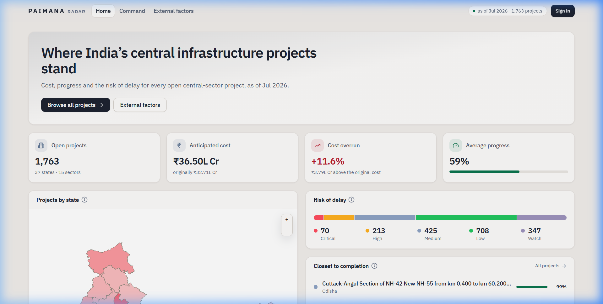
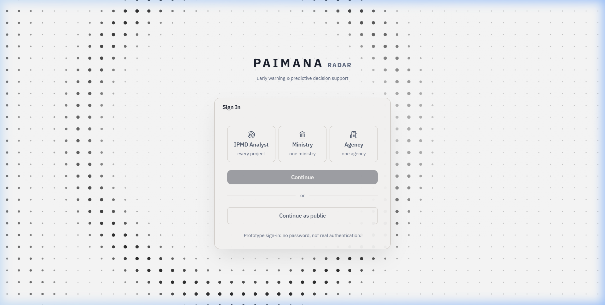
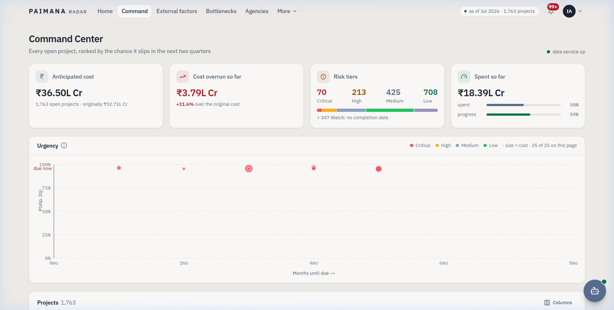
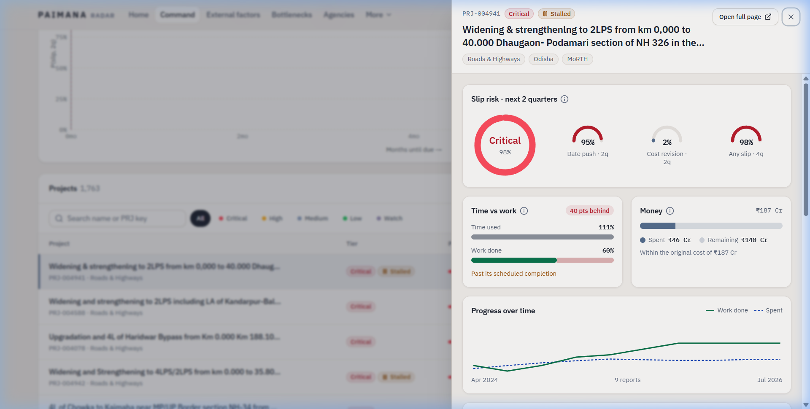
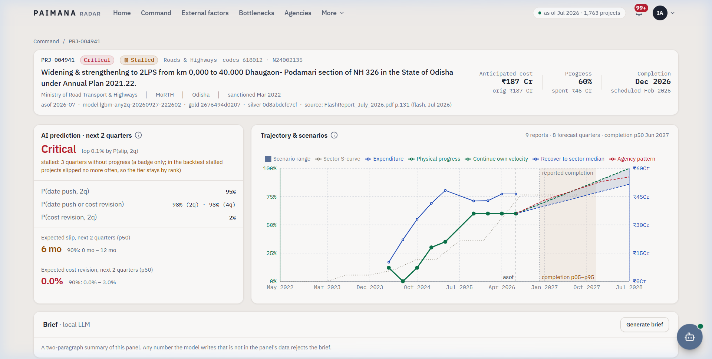
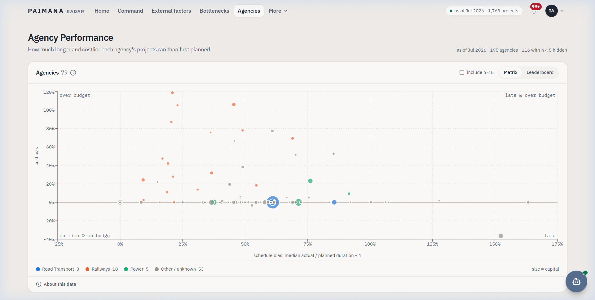
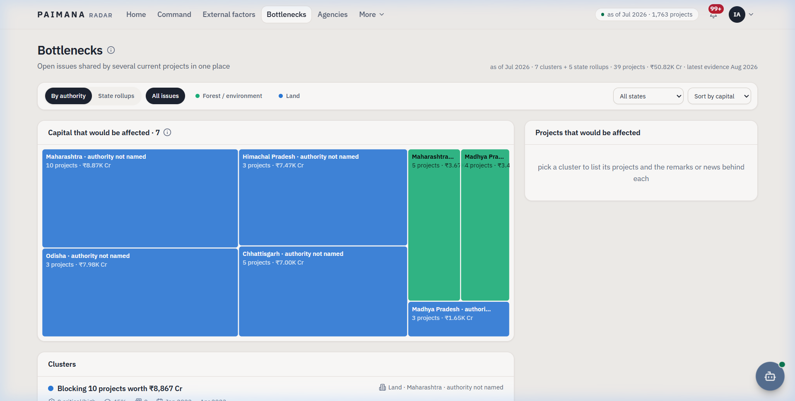
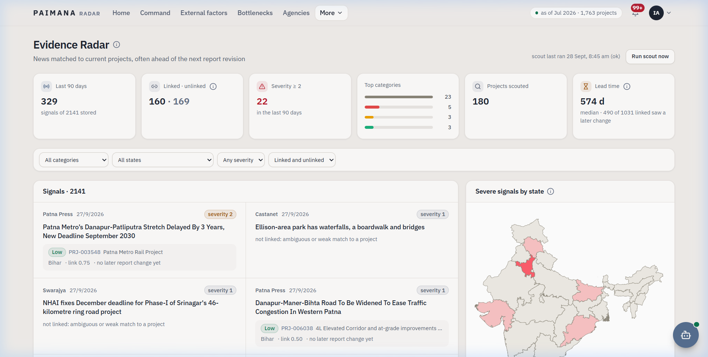
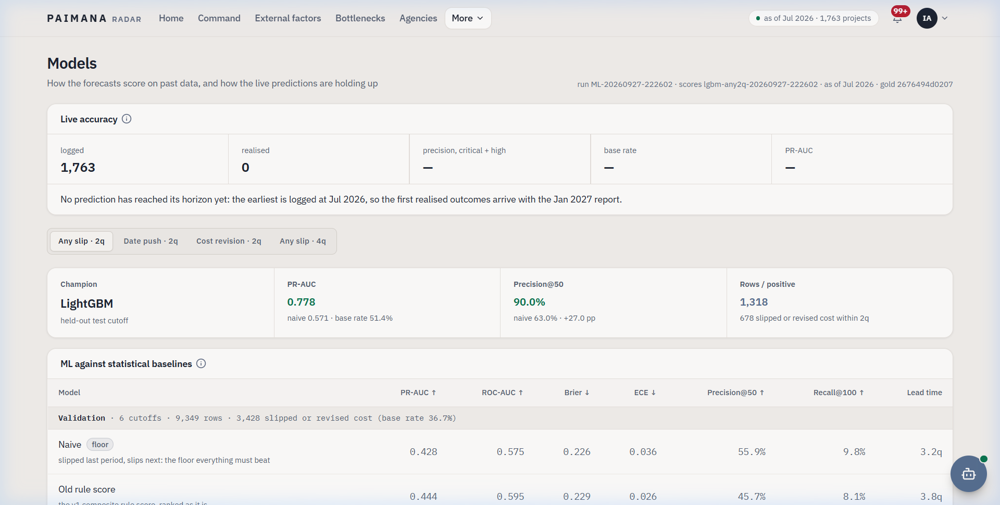
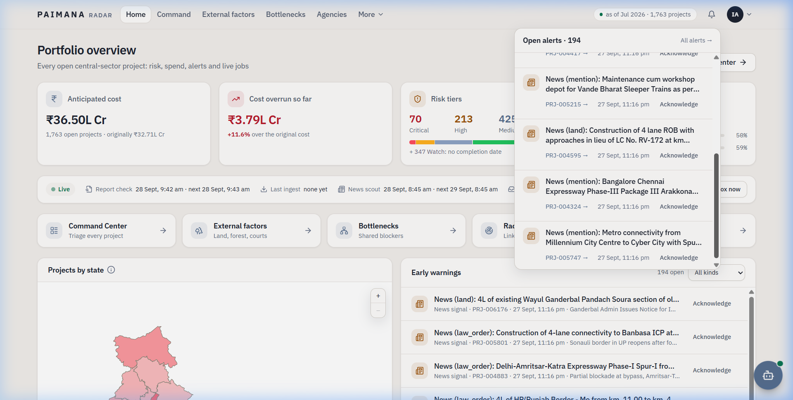

# PAIMANA Radar — Teammate Guide

> This guide is for everyone on the team. No ML or Python experience needed to understand it.  
> **Prathamesh** owns the repo. Branch: `v2-early-warning`. Backend: port 8000. Frontend: port 3000.

---

## What Is This Project?

India has **1,763 active central-sector infrastructure projects** — roads, railways, bridges, pipelines — worth ₹36.5L Cr. Most of them are delayed. By the time a quarterly report mentions the delay, the project has been stuck for months.

**PAIMANA solves this:**
1. It reads **20 years of government PDFs** (262 reports) automatically
2. It **learns** what a delayed project looks like 6 months *before* the delay shows up
3. It **alerts** the right ministry official the moment early warning signs appear

---

## How to Start the App Locally

```bash
# Step 1 — Start the backend (Python, port 8000)
uvicorn backend.main:app --reload --port 8000

# Step 2 — Start the frontend (React, port 3000)
cd frontend && npm run dev
```

Then open **http://localhost:3000** in your browser.

> If the data pipeline hasn't been run yet, ask Prathamesh to share the `dataset/` folder.

---

## Pages — What Each One Does

---

### 🏠 Home Page (`/`)



**What you see:**
- **Top stats** — total open projects, anticipated cost, cost overrun %, average physical progress
- **Projects by state** — an India map coloured by how many Critical/High projects are in each state
- **Risk of delay bar** — 70 Critical · 213 High · 425 Medium · 708 Low · 347 Watch
- **Closest to completion** — projects at 95%+ physical progress

**Who sees what:**
| Role | What changes |
|------|-------------|
| Public | Everything above, read-only; the assistant (chat) answers from the public data only |
| Agency | Only their own projects shown, plus the alerts bell and the assistant on those projects |
| Ministry | Only their ministry's projects, plus the alerts bell and the assistant on those projects |
| IPMD Analyst | Everything, plus jobs, the worker console and the assistant on every project |
| IPMD Administrator | Everything an analyst sees, plus Administration (`/admin`): access requests, users, the audit log |

**Key stat to know:** The risk bar updates automatically every time a new report is processed.

---

### 🔐 Sign-in Page (`/login`)



**Real sign-in.** An official signs in with their email and password; the session lives in a cookie and the backend
checks it on every request. New officials use **Request access** (`/signup`): email, name, role, ministry or agency,
a short justification; an IPMD administrator approves the request in **Administration** (`/admin`) and the person
is told by their administrator. **Continue as public** needs no account.

**Three roles** (set by the administrator, not by you):
- **IPMD Analyst** — sees every project, runs jobs, triggers the AI worker, approves notices; an administrator also
  manages users and access requests
- **Ministry** — sees all projects under their ministry
- **Agency** — sees only their own projects

Every role can use the assistant (chat); it answers only from what that role may see. Activity is logged.

---

### 📊 Command Center (`/command`)



**This is the main working page for IPMD analysts.**

**Top KPI cards:**
- Anticipated cost: ₹36.50L Cr
- Cost overrun: +₹3.79L Cr (+11.6%)
- Risk tiers: 70 / 213 / 425 / 708 / 347 Watch
- Spent so far: ₹18.39L Cr (50% of budget, 59% of work done)

**Urgency scatter plot:**
- X-axis = months until the project's scheduled completion
- Y-axis = probability of slipping in the next 2 quarters
- Dot size = project cost
- Colour = tier (red = Critical, orange = High, etc.)
- Projects in the **top-left** are the most urgent: deadline soon + high slip risk

**Project list below:**
- Sortable by tier, cost, progress
- Filter by tier, sector, state, or free-text search
- Click any row to open the **Project Detail Drawer**

---

### 📋 Project Detail Drawer (opens from any list)



**Slides in from the right when you click a project. Shows at a glance:**

| Panel | What it tells you |
|-------|------------------|
| **Tier ring** | Big coloured circle — Critical (red), High (orange), Medium (grey), Low (green), Watch (purple) |
| **3 gauges** | Date push probability · Cost revision probability · 4-quarter slip probability |
| **Time vs work** | Time used 111% but work only 60% → clearly behind |
| **Money bar** | Spent vs remaining vs original cost |
| **Progress over time** | Line chart: green = work done, blue dashed = spend — lets you see if both are moving together |

**Click "Open full page →"** to see the complete project analysis.

---

### 📄 Full Project Page (`/projects/PRJ-xxxxxx`)



**The complete view for a single project. Two main panels side by side:**

**Left — AI Prediction:**
- Tier + top reason ("stalled: 3 quarters without progress")
- P(date push, 2q) = 95%
- P(date push or cost revision, 2q) = 98%
- Expected slip: 6 months (90% range: 0–12 months)
- Expected cost revision: 0.0%

**Right — Trajectory & Scenarios:**
- Historical data points (dots on line)
- The **dashed vertical line** = today ("asof")
- Three scenario lines after today:
  - *Continue own velocity* — if nothing changes
  - *Recover to sector median* — if the project catches up to how similar projects perform
  - *Agency pattern* — based on what this agency's projects usually do
- Shaded region = 90% confidence band

**Below the fold:**
- 13-row risk checklist with coloured icons
- Top 3 SHAP reasons (why the model scored it this way)
- External factors: PARIVESH stage, land acquisition status, remark flags
- Similar past projects that looked the same and did slip
- Brief section: generate a 2-paragraph plain-English summary using the local LLM

**Provenance strip** (below the title):
- Shows exactly which model version scored this, which gold and silver build it came from, and which source PDF the latest data came from — so you can always trace a number back to its source

---

### 🏢 Agencies (`/agencies`)



**Answers: which agencies consistently run late or over budget?**

- Each dot = one agency
- **X-axis** = schedule bias (how much longer their projects run vs planned; 0% = on time)
- **Y-axis** = cost bias (how much over budget; 0% = on budget)
- **Dot size** = total capital managed
- **Colour** = sector (orange = Railways, blue = Road Transport, green = Power)

**Quadrants:**
- Bottom-left (0,0) = ideal: on time and on budget
- Top-right = late AND over budget
- An agency far to the right ran very late historically; top = very over budget

**Switch to Leaderboard view** for a ranked table.

---

### 🧱 Bottlenecks (`/bottlenecks`)



**Answers: what single issue is blocking multiple projects at once?**

A "bottleneck" = 3 or more projects stuck on the same type of issue (land, forest, court) in the same state.

**Treemap:**
- Each rectangle = one bottleneck cluster
- Size = total capital at risk (₹Cr)
- Blue = Land issue · Green = Forest/environment issue
- Example: "Maharashtra · authority not named — 10 projects · ₹8,87K Cr" (land issue)

**Tabs:**
- **By authority** — who is responsible
- **State rollups** — which states have the most shared issues
- **All issues** — forest + land combined

**Click a cluster** → right panel shows all the projects in it and the remarks/news that flagged the issue.

> This page tells you where a single government action could unblock multiple projects simultaneously.

---

### 📡 Evidence Radar (`/radar`)



**Answers: what is the news saying about our projects right now?**

**Stats row:**
- 329 signals in the last 90 days (out of 2,141 stored total)
- 160 linked to a project · 169 unlinked (too ambiguous)
- 22 high-severity signals (severity ≥ 2)
- Lead time: 574 days median — articles about a project came 574 days before the report confirmed the change

**News feed (left):**
- Each card = one news article
- Shows source, date, severity badge, project linked (if any), link confidence score
- Filters: category, state, severity, linked/unlinked

**State heatmap (right):**
- India map coloured by number of severe signals per state
- Darker = more news about delayed projects in that state

**"Run scout now" button** — manually triggers a fresh news scan (normally runs every 24 hours automatically).

---

### 🌳 External Factors (`/external`)

**Answers: what is blocking projects outside the official report?**

Three types of external evidence:

**1. PARIVESH (Forest Clearance)**
- 173 projects linked to a forest clearance proposal
- 36 have a proposal still open; 19 are past the legal deadline
- Shows the clearance stage (Stage-I / Stage-II), months waiting, proposal number

**2. Land Acquisition (Bhoomi Rashi, 29 states)**
- 412 projects rated by NH number and km range match
- 135 flagged (land acquisition incomplete or unknown)
- Match confidence shown per project (km-range match = 84% accurate; NH alone = 32%)

**3. Remark Flags**
- Keywords found in the report remarks (land, forest, court, contractor, funds)
- Flags older than 4 quarters marked **stale**
- 79 active land flags in the current portfolio

---

### 📈 Models (`/models`)



**Answers: how good is our prediction model and how do we know?**

**Live accuracy card:**
- 1,763 predictions logged
- 0 realised yet (the first ones were logged in Jul 2026; outcomes arrive with the Jan 2027 report)

**Champion model:** LightGBM
- PR-AUC: **0.778** (naive baseline: 0.571)
- Precision@50: **90%** — of the top 50 projects flagged, 9 out of 10 actually slipped
- Naive precision@50: 63% — so we add **+27 percentage points** over doing nothing

**Comparison table (four tabs):**
- Any slip · 2q
- Date push · 2q
- Cost revision · 2q
- Any slip · 4q

Each row shows: model name, PR-AUC, ROC-AUC, Brier score, ECE (calibration error), Precision@50, Recall@100, Lead time (how many quarters ahead the model correctly flagged it).

---

### 💬 AI Worker Console (`/workers`) — IPMD only



**What the AI worker does:**
1. **Auditor** — checks data quality and staleness (pure Python, no LLM)
2. **Scout** — LLM reads top-10 riskiest projects and writes evidence summaries
3. **Analyst** — LLM decides which projects need action
4. **Dispatcher** — LLM drafts a formal notice to the controlling ministry
5. **Drafter** — LLM writes a 2-paragraph brief (any hallucinated number = brief rejected)

**The notices wait here for a human to approve.** Nothing is sent without IPMD approval.

Click **"Trigger worker cycle"** to run it manually. Normally scheduled automatically.

---

## Backend Services (What Runs at Port 8000)

```
uvicorn backend.main:app --port 8000
```

Six background jobs start automatically (`LIVE_JOBS=0` turns them all off):

| Job | Runs every | What it does |
|-----|-----------|--------------|
| **Inbox watcher** | 60 seconds | Checks `dataset/raw/inbox/` for new PDFs or CSVs |
| **News scout** | 24 hours (first run 10 min after start) | Scrapes Google News + PIB, links articles to projects |
| **PARIVESH snapshot** | 6 hours | Pulls latest forest-clearance data |
| **Bhoomi Rashi pull** | Quarterly | Re-pulls land registers (off by default; set `BHOOMI_PULL=1`) |
| **Research agent** | 24 hours (first run 30 min after start) | The local LLM judges the scout's news items into cited research facts, up to 20 projects a run |
| **Second opinion** | 24 hours (first run 45 min after start) | The local LLM's cited reading of the evidence next to the model's tier, up to 15 Critical / High / Watch projects a run; it never changes the tier |

Every job has a time limit; past it the run is marked as an error in `/api/live/status` and the loop goes on. The
two LLM jobs let a chat answer go first and stop cleanly when the backend shuts down.

**When a new report drops in the inbox:**
1. Auto-classified as portal CSV or PAIMANA flash PDF
2. Full pipeline runs: extract → clean → identity → silver → external → research → gold → score → profile
3. Takes ~2 minutes
4. Diff: which projects changed tier? → alerts pushed to browser bell in real time
5. If the pipeline fails: rolls back to old predictions, raises a `pipeline_error` alert

---

## Data Pipeline — How the Numbers Come From PDFs

```
dataset/raw/pdf/          262 PDFs
      │
      ▼ pipeline/extract/ (12 scripts, one per report family)
dataset/clean/_parts/     165,000+ raw rows

      │
      ▼ pipeline/build_identity.py
      Each project gets one stable PRJ-xxxxxx key
      6,253 keys · 1,767/1,775 portal projects matched

      │
      ▼ pipeline/silver.py
      Typed, quarantine-filtered panel
      73,167 project-quarter rows

      │
      ▼ pipeline/external.py + pipeline/parivesh.py + pipeline/bhoomi_rashi.py
      Land, forest, remark flags per project

      │
      ▼ pipeline/gold.py
      Point-in-time features (no future data allowed)
      ~40 features per project-quarter

      │
      ▼ ml/train.py → ml/registry.py → ml/score.py
      LightGBM trained, champion saved, portfolio scored
```

**Rebuild command:**
```bash
python -m pipeline.run silver   # ~29 seconds
python -m pipeline.run gold     # a few seconds more
python -m ml.train              # ~2 minutes
python -m ml.score              # scores live portfolio
```

---

## Key Files to Know

| File | What it is |
|------|-----------|
| `backend/main.py` | FastAPI app entry point — starts jobs, loads data |
| `backend/routes.py` | All 35 API endpoints |
| `backend/live/watcher.py` | Inbox watcher — processes new reports |
| `backend/live/scout.py` | News scout |
| `llm/worker.py` | 5-step AI worker pipeline |
| `pipeline/silver.py` | Cleans raw rows into panel |
| `pipeline/gold.py` | Builds ML features |
| `ml/train.py` | Trains LightGBM |
| `ml/score.py` | Scores current portfolio |
| `ml/registry.py` | Keeps best model, rejects worse ones |
| `frontend/src/views/` | All 10 page components |
| `frontend/src/views/command-center/ProjectDetailDrawer.tsx` | The side panel |
| `docs/PROJECT_OVERVIEW.md` | Full technical reference |
| `docs/IMPLEMENTATION_GUIDE_v2.md` | Architecture decisions |
| `docs/ACCESS_CONTROL.md` | Role/scope policy |

---

## Current Numbers (as of Sep 2026)

| What | Number |
|------|--------|
| Open projects tracked | 1,763 |
| Total portfolio value | ₹36.50L Cr |
| Cost overrun | +11.6% |
| Average physical progress | 59% |
| 🔴 Critical | 70 |
| 🟠 High | 213 |
| 🟡 Medium | 425 |
| 🟢 Low | 708 |
| ⬜ Watch (no completion date) | 347 |
| Model PR-AUC (2-quarter) | 0.778 |
| Precision@50 | 90% |
| Backend tests passing | 264 |
| Frontend lint + typecheck | ✅ clean |

---

## Who Built What

| Team member | Contribution |
|-------------|-------------|
| **Prathamesh** | Data pipeline, ML model, backend API, identity resolver, external factors, overall architecture |
| **Pranjal** | Chat panel (full-height, resizable, scoped to ministry) — 8 commits on `frontend-dev` |
| **Garvit** | External factors research, original Parivesh and delay-band design |

---

## Glossary

| Word | Simple meaning |
|------|---------------|
| **PRJ- key** | A permanent ID for a project that works across 20 years of differently-formatted reports |
| **Silver layer** | The cleaned, checked dataset — one row per project per quarter |
| **Gold layer** | The ML-ready features built without using any future data |
| **Tier** | Risk category: Critical / High / Medium / Low / Watch |
| **PR-AUC** | How well the model ranks risky projects. 0.5 = random, 1.0 = perfect |
| **Slip** | A project's expected completion date moved later |
| **SHAP** | A number that explains why the model flagged a project |
| **Analogue** | A past project that looked just like this one — and eventually slipped |
| **PARIVESH** | India's government portal for forest-clearance approvals |
| **Bhoomi Rashi** | India's government portal for land-acquisition records |
| **Quarantine** | Bad data rows set aside for review — never deleted |
| **SSE / Bell** | Real-time alerts pushed from the server to your browser as soon as a new report is processed |
| **Champion** | The current best model — only replaced when a newer model provably beats it |
| **Stale flag** | A delay flag from remarks that hasn't been seen in 4+ quarters (probably resolved) |
| **Watch tier** | Projects with no completion date — can't be scored, shown separately |

---

*Branch: `v2-early-warning` · All 105 commits under prathameshDahe123 · No Claude co-author*

